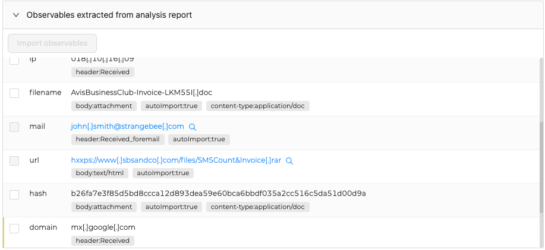

This Analyzer allows you to view the content of an email without opening it in a dedicated application.

This programs gathers headers, message content, files, gives access to the raw message and extracts following observables: 

- email addresses from headers
- IP addresses and hostnames from headers
- URLs found in plain text and html content
- filenames and Files attached

Extracted observables are enriched with tags giving context.

### Email visualisation
An option permits to get an overview of the HTML rendered email. The program creates a screenshot of html parts of the message, inline and attachment parts.
By default, this option is **not** enabled. To proceed, the Analyzer requires the program `wkhtmltoimage` beeing installed on the system. 

When enabled, the Analyzer tries to render the html included in the email. If it fails, a dedicated message is displayed.

### Requirements
`wkhtmltopdf` program is required to enable visualisation. DEB and RPM packages exist.
Once installed, in Cortex, configure the Analyzer accordingly :

- set the parameter `email_visualisation` to true.
- If needed, replace the default value of the `wkhtmltoimage` program path in the parameter `wkhtmltoimage_path` (the default value suits the docker image of the Analyzer).